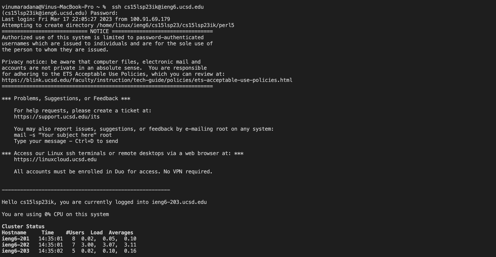
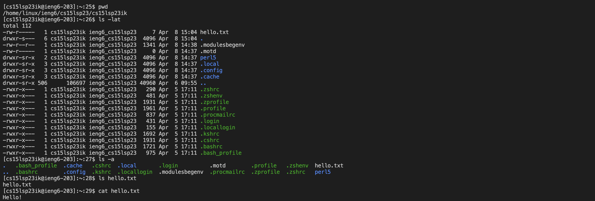
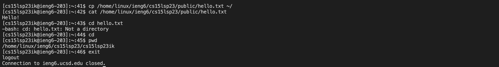

## **Lab Report 1 - Remote Access and FileSystem**

## **How to log into your course-specific account on ieng6**


### Step 1: Installing  VS Code 


I already installed VS Code to my computer prior to this lab, so I didn't have to do anything. But, if
you don't have VS code, then go to the visual studio code website and follow the instructions to download it 
and install it on to your computer. 


### Step 2: Remotely Connecting

I ran the following command which is specific to my cse 15l account.

`$ ssh cs15lsp23ik@ieng6.ucsd.edu`

Then, I received the following message to which I replied yes.
```
⤇ ssh cs15lsp23ik@ieng6.ucsd.edu
The authenticity of host 'ieng6.ucsd.edu (128.54.70.227)' can't be established.
RSA key fingerprint is SHA256:ksruYwhnYH+sySHnHAtLUHngrPEyZTDl/1x99wUQcec.
Are you sure you want to continue connecting (yes/no/[fingerprint])? 
```
After granting access, I typed in my password. Note that you won't see any text while typing your password 
as it is invisible. I initially ran into problems as it didn't log me in. But, after trying multiple times, 
I successfully logged in and received the following message.




### Step 3: Running Some Commands

Try running the commands cd, ls, pwd, mkdir, and cp a few times in different ways on your computer after ssh-ing 
(use the terminal in VScode). I tested a few commands in various methods to understand their functionality as you
can see below:



