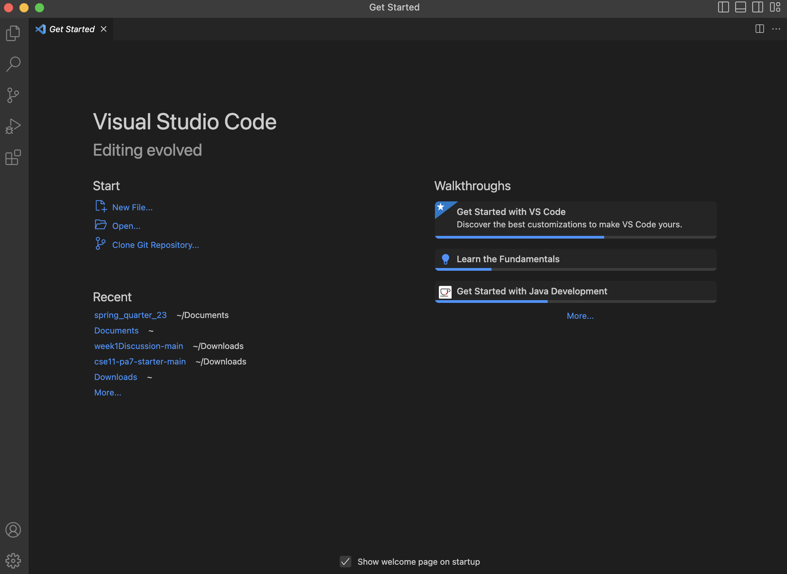

## **Lab Report 1 - Remote Access and FileSystem**

### **How to log into your course-specific account on ieng6**

1. Install VS Code 

I had already installed VS Code to my computer prior to this lab, so I didn't have to do anything. But, if
you don't have VS code, then go to the visual studio code website and follow the instructions to download it 
and install it on to your computer. 

2. Two
3. Three
