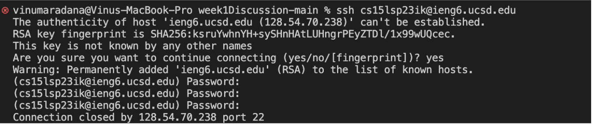

## **Lab Report 1 - Remote Access and FileSystem**

## **How to log into your course-specific account on ieng6**

### Step 1: Your CSE15L Account

Look up your course-specific account [here](https://sdacs.ucsd.edu/~icc/index.php).

Reset your password following the tutorial below:

[How To Reset Your CSE15L Password](https://drive.google.com/file/d/17IDZn8Qq7Q0RkYMxdiIR0o6HJ3B5YqSW/view)


### Step 2: Installing  VS Code 


I already installed VS Code to my computer prior to this lab, so I didn't have to do anything. But, if
you don't have VS code, then go to the [Visual Studio Code Website](https://code.visualstudio.com) and follow the instructions to download it 
and install it on to your computer. 

<br>

### Step 3: Remotely Connecting

I ran the following command which is specific to my cse 15l account.

`$ ssh cs15lsp23ik@ieng6.ucsd.edu`

Then, I received the following message to which I replied yes.
```
⤇ ssh cs15lsp23ik@ieng6.ucsd.edu
The authenticity of host 'ieng6.ucsd.edu (128.54.70.227)' can't be established.
RSA key fingerprint is SHA256:ksruYwhnYH+sySHnHAtLUHngrPEyZTDl/1x99wUQcec.
Are you sure you want to continue connecting (yes/no/[fingerprint])? 
```
After granting access, I typed in my password. Note that you won't see any text while typing your password 
as it is invisible for privacy and security reasons.

Initially, I ran into connection errors preventing me from logging in. I received the following message every time
I attempted to input my password:



If you run into this error, make sure you're entering in your password correctly and you have waited a bit after you reset your password.
If this error still progresses, ask for help.

But, after trying multiple times and waiting for about an hour or so, I successfully logged in and received the following message.


<br>

### Step 4: Running Some Commands

Try running the commands cd, ls, pwd, mkdir, and cp a few times in different ways on your computer after ssh-ing 
(use the terminal in VScode). I tested a few commands in various methods to understand their functionality as you
can see below:


