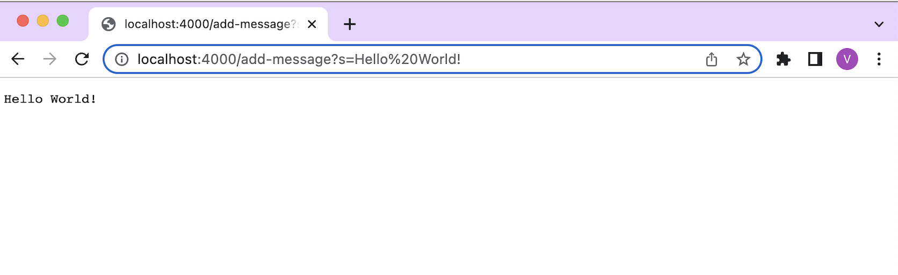
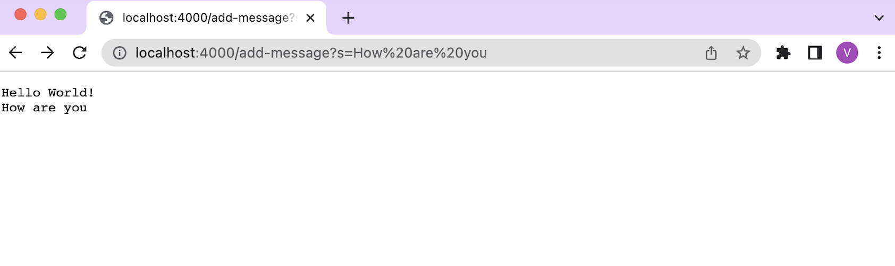
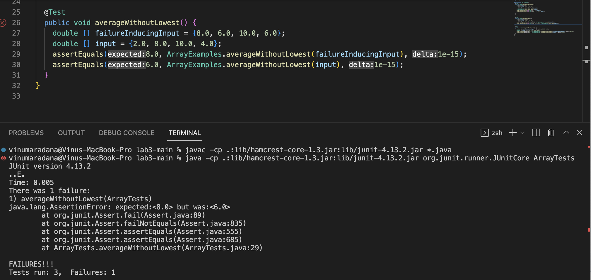
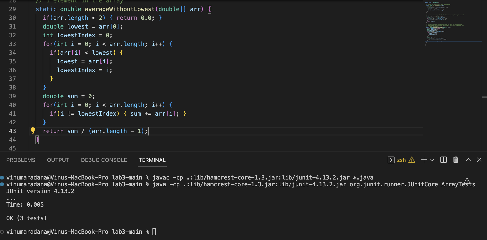

## **Lab Report 2 - Servers and Bugs**

### Part 1: Creating a Web Server

Write a web server called StringServer that supports the path and behavior described below. It should keep track of a 
single string that gets added to by incoming requests. The requests should look like this:

`/add-message?s=<string>`


The following is my code for StringServer:

```
import java.io.IOException;
import java.net.URI;

class Handler implements URLHandler {
    // A string that will be manipulated by various requests.
    String output = "";

    public String handleRequest(URI url) {
        if (url.getPath().contains("/add-message")) {
            String[] parameters = url.getQuery().split("=");
            if (parameters[0].equals("s")) {
                output += parameters[1] + "\n";
            }
        }
        return output;
    }
}

class StringServer {
    public static void main(String[] args) throws IOException {
        if(args.length == 0){
            System.out.println("Missing port number! Try any number between 1024 to 49151");
            return;
        }

        int port = Integer.parseInt(args[0]);

        Server.start(port, new Handler());
    }
}
```

After writing the code for StringServer, I altered the path to check that the code produced the expected output as you can
see in the following screenshots.

**Screenshot 1**

- The main and the handleRequest methods were called
- The argument for the main was `4000`, which was the port number, and argument for handleRequest was the url 
`"http://localhost:4000/add-message?s=Hello%20World!"`
- The value of the field `output` was initially `""`
- But, after the specific request, the value of the `output` is `"Hello World! \n"`

**Screenshot 2**

- The main and the handleRequest methods were called
- The argument for the main was `4000`, which was the port number, and argument for handleRequest was the url
 `"http://localhost:4000/add-message?s=How%20are%20you"`
- The value of the field `output` was initially `"Hello World! \n"`
- But, after the specific request, the value of the `output` is `"Hello World! \n How are you \n"`


### Part 2: Bugs
For this part, I chose the `averageWithoutLowest` method in `ArrayExamples.java` file in lab 3, whose code is listed below.  

```
  // Averages the numbers in the array (takes the mean), but leaves out the
  // lowest number when calculating. Returns 0 if there are no elements or just
  // 1 element in the array
  static double averageWithoutLowest(double[] arr) {
    if(arr.length < 2) { return 0.0; }
    double lowest = arr[0];
    for(double num: arr) {
      if(num < lowest) { lowest = num; }
    }
    double sum = 0;
    for(double num: arr) {
      if(num != lowest) { sum += num; }
    }
    return sum / (arr.length - 1);
  }
```

To identify a failure-inducing input for the buggy program, I examined the logic of the code and brainstormed a test that will produce an error message and reveal the bug of the program. The following is a part of an example of a **failure-inducing input** from `ArrayTests.java`:

```
    double[] failureInducingInput = {8.0, 6.0, 10.0, 6.0};
```

The following is part of an example of an input that doesn’t induce a failure:

```
    double [] input = {2.0, 8.0, 10.0, 6.0};
```

The J-Unit test using both the inputs is the following:
```
 @Test
  public void averageWithoutLowest() {
    double [] failureInducingInput = {8.0, 6.0, 10.0, 6.0};
    double [] input = {2.0, 8.0, 10.0, 6.0};
    assertEquals(8.0, ArrayExamples.averageWithoutLowest(failureInducingInput), 1e-15);
    assertEquals(8.0, ArrayExamples.averageWithoutLowest(input), 1e-15);
  } 
```

Next, I found the symptom or the output of running the tests by running the following commands in the terminal of my VS code.

```
local $ javac -cp .:lib/hamcrest-core-1.3.jar:lib/junit-4.13.2.jar *.java
local $ java -cp .:lib/hamcrest-core-1.3.jar:lib/junit-4.13.2.jar org.junit.runner.JUnitCore ArrayTests
```

The symptom of the `averageWithoutLowest` method can be seen below:


The bug in this method `averageWithoutLowest` is that it doesn't account for repeated numbers in the inputted array. Specifically, in the first test where we used the failure-inducing input, 6.0 is left out twice while calculating the mean of the numbers in the array. 

To fix the bug, you have to change the code. The following code blocks are the before-and-after code change.

**Before:**
```
static double averageWithoutLowest(double[] arr) {
    if(arr.length < 2) { return 0.0; }
    double lowest = arr[0];
    for(double num: arr) {
      if(num < lowest) { lowest = num; }
    }
    double sum = 0;
    for(double num: arr) {
      if(num != lowest) { sum += num; }
    }
    return sum / (arr.length - 1);
 }
```

**After:**
```
  static double averageWithoutLowest(double[] arr) {
    if(arr.length < 2) { return 0.0; }
    double lowest = arr[0];
    int lowestIndex = 0;
    for(int i = 0; i < arr.length; i++) {
      if(arr[i] < lowest) { 
        lowest = arr[i];
        lowestIndex = i;
      }
    }
    double sum = 0;
    for(int i = 0; i < arr.length; i++) {
      if(i != lowestIndex) { sum += arr[i]; }
    }
    return sum / (arr.length - 1);
  }
```
The result of running the tests on the fixed code is the following:


This code fix addresses this issue by finding the first index of the lowest number in the array and ommitting the number at that index while calculating the sum of all the numbers except the lowest in the array. This addresses the bug by assuring that the lowest number doesn't get left out multiple times while calculating the `averageWithoutLowest` value. 

### Part 3: Reflection
In week 2, I learned about different parts of a URL, which I use every single day but never knew what it truly means, and applied my knowledge while learning how to run and build a servers. In week 3, I learned an important skill in programming, which is identifying bugs using failure-inducing inputs and their corresponding symptoms and fixing the bugs in a program.
