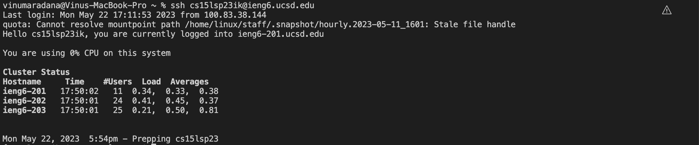
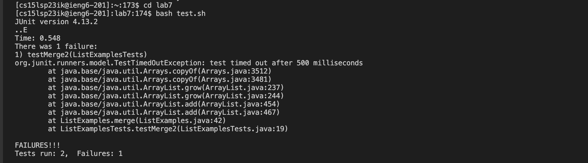
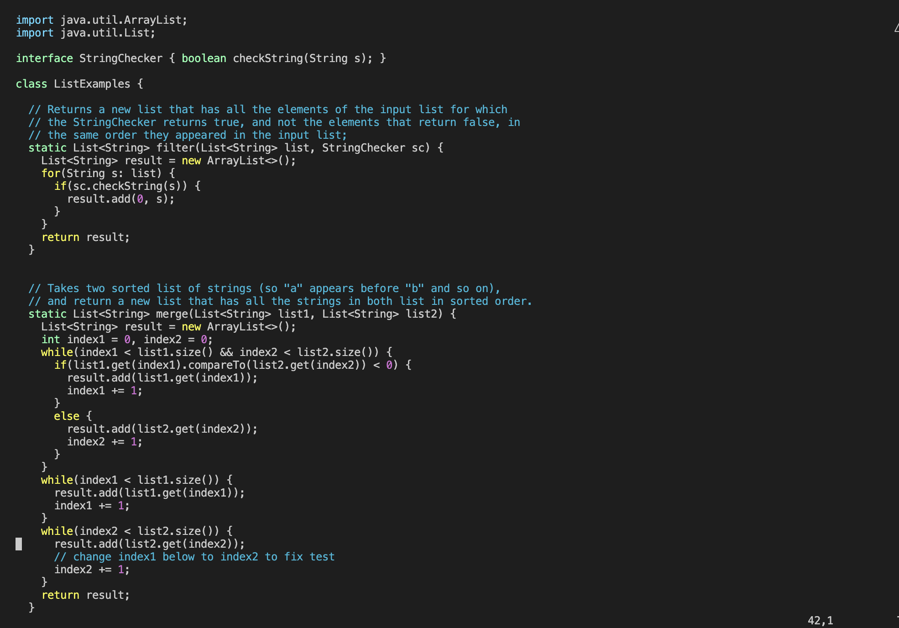
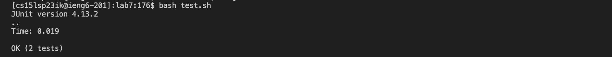
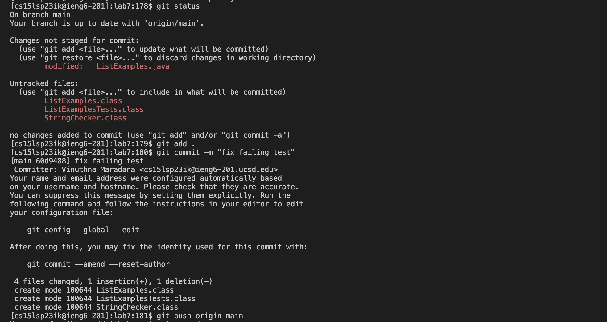
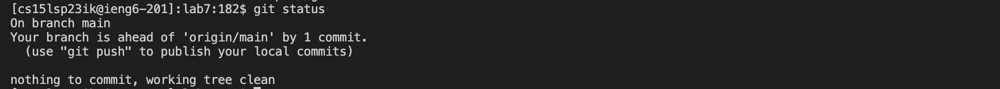

## Lab Report 4

### 1. Log into ieng6

To log into my ieng6 account, I just ran the following command and it automatically logged me in without prompting me for my password. 

`$ ssh cs15lsp23ik@ieng6.ucsd.edu`



### 2. Clone your fork of the repository from your Github account

To access the link of the repository, I opened the lab7 link and forked it on GitHub. To clone my fork of the repository from my GitHub Account, I ran the following command, which includes the link I got after I forked the repository. 

`$ git clone https://github.com/vinumaradana/lab7`


### 3. Run the tests, demonstrating that they fail

To run the tests, I typed the following: 

```
$ cd lab7 <enter>
$ bash test.sh
```

I used `cd` command to access and go into the lab7 directory. Then, I ran the `bash` command, so `bash` ran the commands in the `test.sh` file. The output of running the tests is represented by the screenshot below.





### 4. Edit the code file to fix the failing test
 To fix the failing tests, I ran the `vim ListExamples.java` to edit the code file `ListExamples.java` in the `vim` text editor. This caused the `vim` text editor to open my file. 
 
 

Then, I pressed the following keys to make the required change.

```
\index <enter>
n n n n n n n n n l l l l l l r 2 <esc> :wq
```
 
 
The `\index` in the Command Mode searches for `index` pattern throughout the text. I typed `n` 9 times to find the nineth occurence of `index` in the `ListExamples.java` and then, I typed `l` six times to go six spaces to the right. After, I typed `r`and then `2` which changed `index1` to `index2` since `r` replaces the current character with the character entered by the user. Then, I typed `<esc>` to return to Commnand Mode from Insert Mode and `:wq` to save and quit.

### 5. Run the tests, demonstrating that they now succeed

Then, I ran the following command to run the tests, which resulted in the output in the screenshot. All the tests now run successfully. 

`bash test.sh`



### 6. Commit and push the resulting change to your Github account

To do the last step, I typed the following, resulting in the output in the screenshot.
```
$ git status
$ git add ListExamples.java <enter>
$ git commit -m "fix failing test"
$ git push origin main
```


I ran `git status` to check the state of the working directory and the staging area. This is an optional step. Then, I used `git add ListExamples.java` to add my change in the local working directory to the repository. Next, I used `git commit -m "fix failing test"` to commit the staged files and `"fix failing test"` as the message describing the commit. Lastly, I ran `git push origin main` to push the local branch to the repository. 

Then I used `git status` to check the status of the repository after committing once. I received the following output. 


